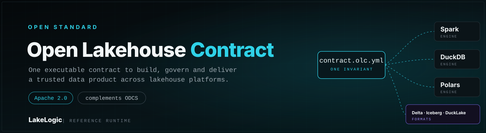

<div align="center">



# Open Lakehouse Contract

**The open standard for portable, executable lakehouse data contracts.**

[Documentation](https://lakelogic.github.io/open-lakehouse-contract/) · [Quickstart](docs/getting-started.md) · [Contract reference](docs/reference/schema.md) · [Compatibility evidence](docs/providers/index.md)

</div>

Define a data product's sources, schema, ownership, quality rules, PII handling, lineage, service levels (SLAs and SLOs), transformations and materialisation in one portable, vendor-neutral contract.

Open Lakehouse Contract (OLC) captures that definition in a portable YAML document.

The contract declares the intent. Any tool can validate its structure with JSON Schema, and a conforming runtime such as [LakeLogic Core](https://github.com/LakeLogic/LakeLogic) can execute that intent.

## Validate a contract in 60 seconds

```yaml
version: 1.0.0
info:
  title: Orders
  table_name: orders
model:
  fields:
    - name: order_id
      type: integer
      required: true
quality:
  row_rules:
    - name: positive_order_id
      sql: "order_id > 0"
```

Clone the repository, install the CLI and validate the example:

```bash
git clone https://github.com/LakeLogic/open-lakehouse-contract.git
cd open-lakehouse-contract
python -m pip install -e .
olc validate examples/orders.olc.yaml
```

The validator uses the published JSON Schema. It does not require a data engine or LakeLogic Core.

## What OLC gives you

- **Earlier feedback.** Reject invalid contracts in CI before a pipeline change reaches production.
- **Clear accountability.** Record who owns the data product and the downstream consumers that depend on it.
- **Consistent governance.** Keep schema, quality, PII handling, lineage and service-level expectations in one reviewable artifact.
- **Executable intent.** Let a conforming runtime validate, quarantine, transform and materialise data from the declaration.
- **Portable definitions.** Keep business intent separate from backend-owned engine, catalogue, storage and table-format settings.
- **Safer automation.** Give humans and AI agents a typed contract they can validate before proposing or applying changes.

## Execute with LakeLogic Core

OLC is the standard. [LakeLogic Core](https://github.com/LakeLogic/LakeLogic) is the open-source reference runtime.

```bash
python -m pip install lakelogic
```

```python
from lakelogic import DataProcessor

processor = DataProcessor("orders.olc.yaml", engine="duckdb", strict=True)
accepted, quarantined = processor.run(source_df)
```

You can use the OLC schema without LakeLogic Core, and another runtime may implement the same specification.

## Contract coverage

| Concern | Examples |
|---|---|
| Sources and ingestion | Primary source, linked sources, load mode, watermark and post-ingestion lifecycle |
| Identity and ownership | Product metadata, accountable owner and downstream consumer ownership |
| Schema and keys | Fields, types, required values, primary keys and natural keys |
| Quality | Row rules, dataset rules, uniqueness and null thresholds |
| Transformation | SQL and typed transformation operations |
| Governance | PII classification, masking, compliance metadata and quarantine |
| Service levels | Freshness, availability and volume SLOs; downstream SLA expectations |
| Operations | Lineage, notifications and run controls |
| Materialisation and delivery | Write strategy, table format, target location and downstream consumers |

See the [field reference](docs/reference/schema.md) for the complete vocabulary.

## Compatibility and evidence

OLC separates portable contract intent from runtime and platform configuration. Support is demonstrated at different levels:

- **Structural conformance** proves a contract matches the public schema.
- **Runtime conformance** compares observable behaviour across supported engines.
- **Provider evidence** records what was deployed and materialised on each platform.

DuckDB and Polars run in the default executable-conformance suite. Other engines and platforms have their own stated scope and limitations. See the [conformance suite](docs/reference/conformance.md) and [provider evidence matrix](docs/providers/index.md) rather than assuming every engine × format × platform combination has identical coverage.

## Documentation

- [Getting started](docs/getting-started.md) — validate and execute your first contract.
- [What is OLC?](docs/concepts/what-is-olc.md) — understand the contract/runtime boundary.
- [Contract reference](docs/reference/schema.md) — define sources, ownership, quality, transformation, lineage, service levels and materialisation.
- [Conformance](docs/reference/conformance.md) — see how structural and runtime behaviour are tested.
- [Providers](docs/providers/index.md) — inspect evidence and limitations by platform.
- [OLC and ODCS](docs/concepts/vs-odcs.md) — understand how the standards complement each other.

Contributions are welcome. Start with the [contributing guide](docs/contributing.md).

## Licence

Apache License 2.0. See [LICENSE](LICENSE).
