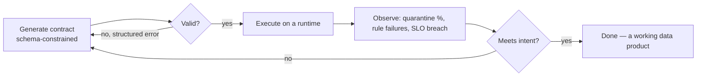

# Agent-Native

An Open Lakehouse Contract is an unusually good substrate for **AI data agents** — not because it mentions AI anywhere, but because of four properties it already has: it's **typed**, **self-validating**, **executable**, and **portable**. Those four turn the usual "LLM writes some SQL and hopes" loop into a closed, verifiable one.

## The four properties, and what each unlocks

| Property | What it gives an agent |
|---|---|
| **Typed** (JSON Schema from Pydantic) | *Generate by construction.* The schema is a structured-output / tool-call constraint, so the model emits a **valid contract**, not free text you post-hoc parse. |
| **Self-validating** | *Self-correct.* A rejected contract comes back with a precise, structured error (`model.fields.2.type` invalid) the agent can act on — a tight repair loop, not a vibe. |
| **Executable** | *Act and observe.* The agent doesn't stop at a document — it runs the contract and sees **real outcomes**: rows quarantined, rules failed, SLOs missed. Ground truth, not a guess. |
| **Portable** | *Transfer.* The same reasoning applies on Databricks, Snowflake, BigQuery, DuckDB… The agent learns the contract once, not once per platform. |

## The closed loop

Every arrow here is *checkable*. The agent is never asked to be right in one shot; it's asked to converge, and each step gives it a concrete signal to converge on. That's the difference between "an LLM that writes pipelines" and "an agent that produces a data product you can trust."

## Why the executable part is the crux

A descriptive spec lets an agent *describe* a dataset. An executable spec lets an agent **close the loop against reality**:

- It proposes `amount > 0` as a quality rule → runs it → sees 4% of rows quarantined → decides whether that's a data problem or a bad rule.
- It proposes `strategy: scd2` on a dimension → runs it → inspects the resulting history table → confirms the grain.
- It proposes a PII masking policy → runs it → verifies the masked output before anything ships.

Without execution, each of those is speculation. With OLC, each is an observation.

## Practical shape

- **Generation:** feed `schema/open-lakehouse-contract.schema.json` to the model as a response-format / tool schema. You get a syntactically valid OLC every time.
- **Repair:** on a validation failure, hand the structured error back. Pydantic-derived errors are specific enough to fix a single field.
- **Grounding:** run via the reference runtime (`DataProcessor.run` → `materialize`) and feed the returned metadata (rows written, quarantine counts, failed rules) back to the agent as the reward/critique signal.
- **Portability:** none of the above changes when you swap `engine:` or `format:`. The agent's competence transfers across the whole [providers matrix](../providers/index.md).

!!! note "Naming"
    OLC is "agent-native" as a *consequence* of being typed + executable + portable — not a marketing layer bolted on. There is nothing AI-specific in the schema. Agents just happen to be the consumer that benefits most from a contract that can check its own work.
