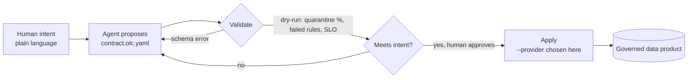
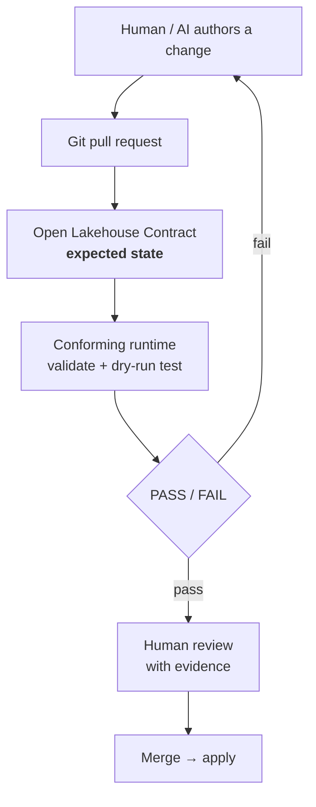
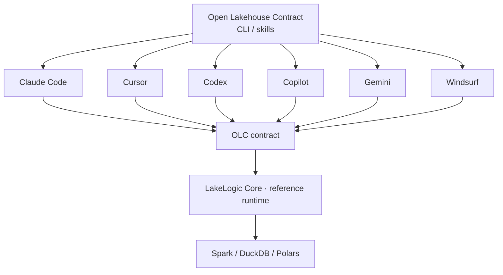

# Agent Workflow

**Spec-driven development for data products.** Instead of an AI agent improvising a pipeline in chat, it proposes an **OLC contract** — one artifact that *both the human and the agent read* — you review it, and only then is data materialized. Same "align before acting" idea as [OpenSpec](https://github.com/Fission-AI/openspec) for code, applied to the data plane.

Three properties make this work, and they're the whole point of OLC:

- **Intent is separated from engine.** The contract declares *what* the data product is — schema, quality, PII, SLOs. *Where* it runs (Spark / DuckDB / Polars → Delta / Iceberg / DuckLake on any platform) is a flag chosen at apply time, never baked into the contract. The agent reasons about intent; the runtime handles the engine.
- **One artifact, two readers.** The same YAML is human-readable (an analyst can review a `MERGE` strategy or a PII flag) and machine-readable (the agent generates and validates it against a JSON Schema). No translation layer, no drift between "the plan" and "the pipeline."
- **Persistent intent.** The contract lives *in the repository*, beside the data product — not in a chat log. Tell one agent "`customer_id` must never be null and this table must refresh every 2 hours" and it holds for this conversation; write it into the contract and it holds forever, for the next engineer and the next agent. **The AI tool changes, the model changes, the data platform changes — the contract remains.**

## Why a contract beats a code spec for agents

OpenSpec's specs describe code an agent still has to write — and can't automatically verify. An **OLC contract is itself executable and self-checking**, so the loop closes on ground truth, not a guess:



Every arrow is checkable: the agent generates a **valid** contract (schema-constrained), **self-corrects** on structured errors, **dry-runs** to observe real outcomes, and only then materializes. See [Agent-Native](agent-native.md) for the four properties (typed · self-validating · executable · portable) behind this.

## The loop — data-engineering-native verbs

OLC deliberately uses **data-engineering verbs**, not a generic software-spec workflow. The loop reads the way a data engineer thinks about a data product:

| Step | Command | What happens |
|---|---|---|
| **Discover** | `/olc:discover` | Analyse the repo and data model; propose Open Lakehouse Contracts for the data products it finds. |
| **Contract** | `/olc:contract <product>` | Generate or update the contract for one data product — a **valid** draft with rationale + task checklist. Nothing runs yet. |
| **Impact** | `/olc:impact "<change>"` | Impact analysis: *"add `customer_segment` to `customer_360`"* → what schema / consumers / SLOs are affected. |
| **Review** | `/olc:review` | Compare the current changes against the applicable contracts and flag **breaking** schema / quality / SLO / PII / lineage / materialization changes (the merge gate). |
| **Validate** | `/olc:validate` | JSON-Schema check **plus a dry-run on synthetic data generated from the contract** (no real data needed) → rows, quarantine %, failed rules, SLO status. The agent self-corrects on the errors. |
| **Apply** | `/olc:apply --provider <x>` | Materialize for real (merge / SCD2 → Delta / Iceberg / DuckLake). **The engine is chosen here, not in the contract.** |

Not `propose → apply` (a generic software-spec workflow) — `discover → contract → review → validate → impact`. That's what makes OLC feel like a data-engineering standard rather than OpenSpec with different nouns.

!!! tip "No real data? Validate against synthetic data"
    The dry-run **doesn't need production data**. The reference runtime generates synthetic data *from the contract itself* — `lakelogic generate --contract <file> --rows N` produces rows that respect the declared types, nullability, `accepted_values`, and ranges (Faker-semantic, so `customer_email` looks like an email). So an agent can validate a contract the moment it writes it — **greenfield, in CI, before a single real row exists**. And it can prove the gates *fire*: `--invalid-ratio 0.1` deliberately injects bad rows so the agent confirms the quality rules and quarantine actually catch them. Real data, when it exists, just deepens the same check.

## Greenfield and brownfield

The same verbs work whether you're starting fresh or wrapping an existing platform — only the *starting point* differs. OLC is **brownfield-first on purpose**: you should get value from the first contract on a live platform without pausing to document everything.

**Greenfield — start from intent.** No pipelines or data yet. The agent writes the contract *first* (`/olc:contract`), validates it against **synthetic data** (nothing real exists yet), and only then builds. The contract doubles as the design doc *and* the pipeline spec: agree on it, then materialize it on whatever engine you choose.

```
contract  →  validate (synthetic)  →  apply
```

**Brownfield — start from reality.** You already have tables, dbt models, Spark jobs, a warehouse. OLC does **not** require a rewrite — adopt it incrementally:

- `/olc:discover` reverse-engineers draft contracts from what already exists — table DDL, dbt schemas, existing SQL.
- `/olc:validate` runs them against your **real** existing data, so the contract captures reality (today's schema, quality, volume, freshness).
- From then on, `/olc:review` gates changes to that data product; contracts **accumulate around the changes you make**, not as a big-bang documentation project.
- OLC sits *beside* your stack — it governs the pipeline's output, it doesn't replace the pipeline. Start with a single `/olc:validate` in CI on one important table and grow. Existing [ODCS](vs-odcs.md) agreements import directly.

| | Greenfield | Brownfield |
|---|---|---|
| **Start from** | intent — what it *should* be | reality — what it *is* |
| **First verb** | `contract` | `discover` |
| **Validate against** | synthetic data | your real existing data |
| **Adoption** | contract-first, then build | one table at a time, accumulate |
| **OLC's role** | the design + the spec | a governing gate beside the existing pipeline |

## The `olc/` folder

Mirroring OpenSpec's `openspec/`, contracts and in-flight proposals live in a reviewable folder — the shared source of truth for humans and agents:

```
olc/
  contracts/                 # the living OLC contracts (the "specs")
    silver/revenue_daily.olc.yaml
  changes/                   # in-flight proposals awaiting review
    revenue-daily/
      proposal.md            # why: sources, grain, consumers, decisions
      contract.olc.yaml      # the draft — valid by construction
      tasks.md               # wire source · add rules · set SLO · materialize
```

A change is reviewed as a diff, approved, then applied — so a human is always in the loop before data moves, and the git history *is* the decision record.

## See it in action

```text
You: /olc:contract "daily revenue by city from Stripe charges, drop test rows, freshness < 6h"

AI:  Created olc/changes/revenue-daily/
     ✓ proposal.md        — source: payments.silver_stripe_charges; grain: (date, city);
                             consumers: finance dashboard
     ✓ contract.olc.yaml  — schema (7 fields), quality (fare_non_negative, no test rows),
                             SLO (freshness 6h), materialization: merge   [schema-valid]
     ✓ tasks.md           — 4 steps

You: /olc:validate

AI:  Schema OK. Generated 5,000 synthetic rows from the contract (no real data needed),
     incl. 10% deliberately-bad rows to test the gates. Dry-run:
       4,510 kept · 490 quarantined — every bad row caught by fare_non_negative / no-test-rows
       freshness rule fires correctly.
     The gates work. Point it at real Stripe data to see live pass rates.

You: looks right. /olc:apply --provider duckdb

AI:  Materialized silver.revenue_daily (merge, DuckLake) from live Stripe data — 4,812 rows.
     Same contract runs unchanged on Spark/Delta, Snowflake, or BigQuery — just change --provider.
```

Notice the contract never mentioned DuckDB, Spark, or a bucket. Intent was fixed at `contract`; the engine was chosen at `apply`. Re-running `--provider snowflake` materializes the *identical* contract on Snowflake.

## The contract as a merge gate

The same properties make OLC a natural fit for **code review and CI**. A change — whether a human or an agent authored it — arrives as a git PR. The contract is the *expected state*; a conforming runtime validates and tests the change against it; the PR passes or fails on that result, and a human reviews with the outcome in hand. This is the OLC analogue of an AI code-review gate — but the reviewer is checking *data behaviour*, not just code.



Because the contract declares `primary_key`, `quality`, `materialization`, and SLOs, a reviewer (or an automated check) can see exactly **what must be preserved** when the implementation changes — a `merge` strategy that silently became `append`, a dropped `not_null` rule, a widened PII field all surface as a *diff of intent*, not a buried code change. The contract turns "did this PR break the data product?" into a checkable, PASS/FAIL question.

Note the complementarity with OpenSpec: a code-spec workflow answers *"did the agent build what I asked?"* An OLC contract + a conforming runtime answers the harder, data-specific question — *"does the resulting data product actually satisfy the engineering contract?"* — by executing the rules against real data, not just reading them.

## Portable across every AI agent

The contract is portable across lakehouses; the *workflow* should be portable across AI assistants. OpenSpec proved the pattern — one common engine plus per-assistant command/skill files, so 26+ tools (Claude Code, Cursor, Codex, Copilot, Gemini, Windsurf, …) each expose the same intent through their own mechanism. OLC takes the same approach, and the AI-integration layer is **open — not a cloud product**: it works with your assistant without requiring LakeLogic Cloud.



Developer experience — pick your assistants once, get the same verbs everywhere:

```bash
pip install -e .            # provides the `olc` CLI (validate + init)
olc init --tools all        # install every integration (or --tools claude,cursor for a subset)
```

That copies the per-assistant wrappers into their native locations:

| Assistant | Installs | As |
|---|---|---|
| **Claude Code** | `.claude/commands/olc/*.md` + `.claude/skills/olc/SKILL.md` | slash commands + Agent Skill |
| **Codex** (ChatGPT) | `.codex/prompts/olc-*.md` | custom prompts |
| **Gemini CLI** | `GEMINI.md` + `.gemini/commands/olc/*.toml` | context + TOML slash commands |
| **Cursor** | `.cursor/rules/*.mdc` | project rule |
| **GitHub Copilot** | `.github/copilot-instructions.md` | repo instructions |
| **Windsurf** | `.windsurf/rules/*.md` | rule |
| **Cline** | `.clinerules/*.md` | rule |
| **Amazon Q** | `.amazonq/rules/*.md` | rule |
| **Roo Code** | `.roo/rules/*.md` | rule |
| **Kilo Code** | `.kilocode/rules/*.md` | rule |
| **AGENTS.md** (OpenCode, Zed, Jules, …) | `AGENTS.md` | shared standard |

The verbs stay identical; only the wrapper differs — **all eleven ship today** (see [`skills/`](https://github.com/LakeLogic/open-lakehouse-contract/tree/main/skills)). Slash-command tools (Claude, Codex, Gemini) expose the verbs explicitly; rules-based tools load the OLC guidance automatically for `*.olc.yaml`. The [`AGENTS.md`](https://agents.md) file covers any assistant that reads that emerging cross-tool standard.

> **Test it in Claude Code:** in a repo with `*.olc.yaml`, run `/olc:validate` (validates against the schema — works now), `/olc:contract "<intent>"`, or `/olc:review` (the merge gate). **In ChatGPT:** the same verbs run as Codex prompts, or use a Custom GPT with the schema as knowledge for the web.

!!! note "Where the line sits (open vs. enterprise)"
    The AI integration, the CLI, the skills, and the reference runtime (**LakeLogic Core**) are **open** — no cloud dependency. **LakeLogic Cloud** is the enterprise layer *around* the standard: estate-wide context, telemetry history, Jira/organisational graph, policy & trust, collaboration, managed agents. The open standard is the entry point; the cloud is the enterprise convenience — never a gate on adoption.

## What's real today vs. proposed

!!! info "Honest status"
    **Shipping today:** the `olc` CLI (`olc validate` + `olc init`), agent integrations for **eleven assistants** (Claude Code, Codex, Gemini, Cursor, GitHub Copilot, Windsurf, Cline, Amazon Q, Roo Code, Kilo Code, and the shared `AGENTS.md`) exposing the verbs `discover / contract / review / validate / impact`, schema-only validation with no runtime, and schema-constrained generation. **Provided by the reference runtime (LakeLogic):** the *execution* half — **contract-driven synthetic data generation** (`lakelogic generate`, so validation needs no real data), the dry-run (quarantine %, SLO status), and `apply` (materialize) that `/olc:validate` and `/olc:review` deepen into when a runtime is present. **On the roadmap:** the `olc/` change-folder convention and (not yet published) the `open-lakehouse-contract` package on PyPI.

## Related

- [Agent-Native](agent-native.md) — why typed + self-validating + executable + portable makes OLC ideal for agents.
- [OLC & ODCS](vs-odcs.md) — how OLC complements the descriptive data-contract standard.
- [Execution Order](../reference/execution-order.md) — what a dry-run/apply actually runs (pre → validate → split → post → materialize).
