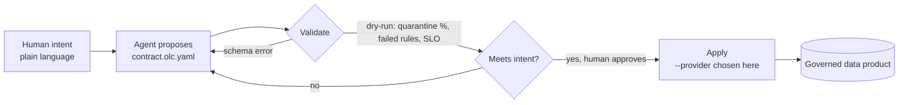

# Agent Workflow

**Spec-driven development for data products.** Instead of an AI agent improvising a pipeline in chat, it proposes an **OLC contract** — one artifact that *both the human and the agent read* — you review it, and only then is data materialized. Same "align before acting" idea as [OpenSpec](https://github.com/Fission-AI/openspec) for code, applied to the data plane.

Two properties make this work, and they're the whole point of OLC:

- **Intent is separated from engine.** The contract declares *what* the data product is — schema, quality, PII, SLOs. *Where* it runs (Spark / DuckDB / Polars → Delta / Iceberg / DuckLake on any platform) is a flag chosen at apply time, never baked into the contract. The agent reasons about intent; the runtime handles the engine.
- **One artifact, two readers.** The same YAML is human-readable (an analyst can review a `MERGE` strategy or a PII flag) and machine-readable (the agent generates and validates it against a JSON Schema). No translation layer, no drift between "the plan" and "the pipeline."

## Why a contract beats a code spec for agents

OpenSpec's specs describe code an agent still has to write — and can't automatically verify. An **OLC contract is itself executable and self-checking**, so the loop closes on ground truth, not a guess:



Every arrow is checkable: the agent generates a **valid** contract (schema-constrained), **self-corrects** on structured errors, **dry-runs** to observe real outcomes, and only then materializes. See [Agent-Native](agent-native.md) for the four properties (typed · self-validating · executable · portable) behind this.

## The loop

| Step | Command | What happens |
|---|---|---|
| **Explore** | `/olc:explore "<intent>"` | The agent asks the right questions — sources? grain? consumers? quality / PII / SLO needs? — and writes a short brief. |
| **Propose** | `/olc:propose "<intent>"` | Generates a change folder with a rationale, a **valid** draft contract, and a task checklist (see below). Nothing runs yet. |
| **Validate** | `/olc:validate` | JSON-Schema check **plus a dry-run on sample data** → rows, quarantine %, failed rules, SLO status. The agent self-corrects on the errors. |
| **Apply** | `/olc:apply --provider <x>` | Materialize for real (merge / SCD2 → Delta / Iceberg / DuckLake). **The engine is chosen here, not in the contract.** |
| **Evolve** | `/olc:evolve "<change>"` | Propose a schema/rule/materialization change to an existing contract as a reviewable **diff**, with a schema-evolution compatibility check. |

## The `olc/` folder

Mirroring OpenSpec's `openspec/`, contracts and in-flight proposals live in a reviewable folder — the shared source of truth for humans and agents:

```
olc/
  contracts/                 # the living OLC contracts (the "specs")
    silver/revenue_daily.olc.yaml
  changes/                   # in-flight proposals awaiting review
    revenue-daily/
      proposal.md            # why: sources, grain, consumers, decisions
      contract.olc.yaml      # the draft — valid by construction
      tasks.md               # wire source · add rules · set SLO · materialize
```

A change is reviewed as a diff, approved, then applied — so a human is always in the loop before data moves, and the git history *is* the decision record.

## See it in action

```text
You: /olc:propose "daily revenue by city from Stripe charges, drop test rows, freshness < 6h"

AI:  Created olc/changes/revenue-daily/
     ✓ proposal.md        — source: payments.silver_stripe_charges; grain: (date, city);
                             consumers: finance dashboard
     ✓ contract.olc.yaml  — schema (7 fields), quality (fare_non_negative, no test rows),
                             SLO (freshness 6h), materialization: merge   [schema-valid]
     ✓ tasks.md           — 4 steps

You: /olc:validate

AI:  Schema OK. Dry-run on 5,000 sample rows:
       4,812 kept · 188 quarantined (1.2% test rows, 2.5% negative fare)
       freshness 3h  ✓ within SLO
     Suggest: the negative-fare rate is high — tighten upstream, or accept as quarantine?

You: accept as quarantine. /olc:apply --provider duckdb

AI:  Materialized silver.revenue_daily (merge, DuckLake) — 4,812 rows.
     Same contract runs unchanged on Spark/Delta, Snowflake, or BigQuery — just change --provider.
```

Notice the contract never mentioned DuckDB, Spark, or a bucket. Intent was fixed at `propose`; the engine was chosen at `apply`. Re-running `--provider snowflake` materializes the *identical* contract on Snowflake.

## What's real today vs. proposed

!!! info "Honest status"
    The **capabilities** this workflow rests on exist now: OLC contracts are generated/validated against a published **JSON Schema** (valid-by-construction for LLMs), and the reference runtime already **dry-runs** (validate + quarantine + report) and **applies** (materialize) across every [provider](../providers/index.md). The **`/olc:*` command surface and the `olc/` change-folder convention are the proposed agent interface** — a thin wrapper over those capabilities — and are on the roadmap, not yet shipped. This page defines the target so tooling (a Claude skill / an `olc` CLI) can be built against a fixed design.

## Related

- [Agent-Native](agent-native.md) — why typed + self-validating + executable + portable makes OLC ideal for agents.
- [OLC & ODCS](vs-odcs.md) — how OLC complements the descriptive data-contract standard.
- [Execution Order](../reference/execution-order.md) — what a dry-run/apply actually runs (pre → validate → split → post → materialize).
