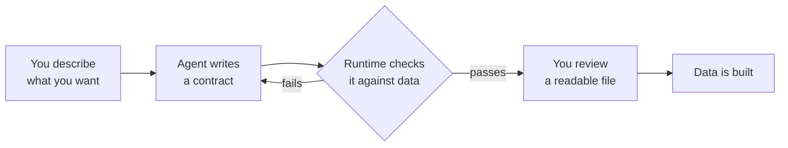

# AI Data Agents

*A gentle, plain-language intro. For the technical version, see [Agent-Native](agent-native.md) and the [Agent Workflow](agent-workflow.md).*

## What's an AI data agent?

Think of it as **a data engineer that's an AI**. It can read your repository, write data pipelines, and — the important part — *check its own work*. On its own, an AI like that is fast but risky: it makes changes and you just have to hope nothing quietly broke. An Open Lakehouse Contract is the thing that makes it **trustworthy**.

## The idea in one line

**The contract is the agent's instructions *and* its report card.** The agent writes down what the data product should be (one readable file), and a runtime actually *runs* that file against data to check whether it's true.

## How it works — a simple example

You tell the agent: *"Give me daily revenue by city from our Stripe data, and it should never be more than 6 hours stale."*

1. **It writes a contract, not a black box.** Instead of silently generating a pipeline, the agent produces a short, human-readable file: here are the columns, revenue must be positive, customer email is PII so mask it, freshness under 6 hours, write it as a merge. You can *read* it and nod — or fix a line — before anything runs.

2. **It checks itself — even with no real data yet.** The agent doesn't need your production database to test the contract. The runtime can **generate realistic synthetic data from the contract itself** and run the rules against it — even deliberately mixing in bad rows to confirm the checks actually catch them. So it can validate the moment it writes the contract, in a pull request, before a single real row exists. When real data arrives, the same check just gets sharper.

3. **It fixes its own mistakes.** If a check fails ("this rule rejected 40% of rows"), the agent sees the exact error, corrects the contract, and re-checks — converging on something that genuinely works, instead of declaring victory and hoping.

4. **It catches regressions later.** Months on, a different engineer (or a different AI) tweaks the SQL. The agent runs a **review**: it compares the change to the contract and says *"⚠️ this quietly turned a merge into an append and dropped the mask on email — FAIL."* The contract catches what a tired human reviewer would miss.

## Why this beats "just ask an AI to build it"

- **The AI can't bluff.** A normal AI says "done" and you hope. Here the contract is *executed*, so "done" means *the data actually satisfies the rules* — a checkable PASS/FAIL, not a promise.
- **The intent doesn't vanish when the chat ends.** Tell an AI "customer_id must never be null" in a conversation and that knowledge dies with the chat. Written into the contract, it lives in the repo forever — the next engineer and the next AI both see it.
- **It works with whatever AI you use.** The same contract and the same commands work in Claude, in ChatGPT/Codex, and others. The AI tool is swappable; the contract is the constant.

## The key difference from AI *coding* tools

A coding assistant can answer: *"Did the AI build what I asked?"*

An OLC contract plus a runtime answers the harder, data-specific question: **"Does the resulting data product actually satisfy the engineering contract?"** — because it runs the rules against data, rather than just reading them.

## In one sentence

> An AI data agent **proposes** a contract, a runtime **proves** it against data (real or synthetic), and the contract **persists** — so you get AI speed with engineering trust, and the data product survives every change of tool, model, and platform.

---

**Next:** [Agent-Native](agent-native.md) explains *why* OLC is so well-suited to agents; the [Agent Workflow](agent-workflow.md) shows the actual commands (`discover → contract → review → validate → impact`) and how to run them in Claude Code or ChatGPT.
