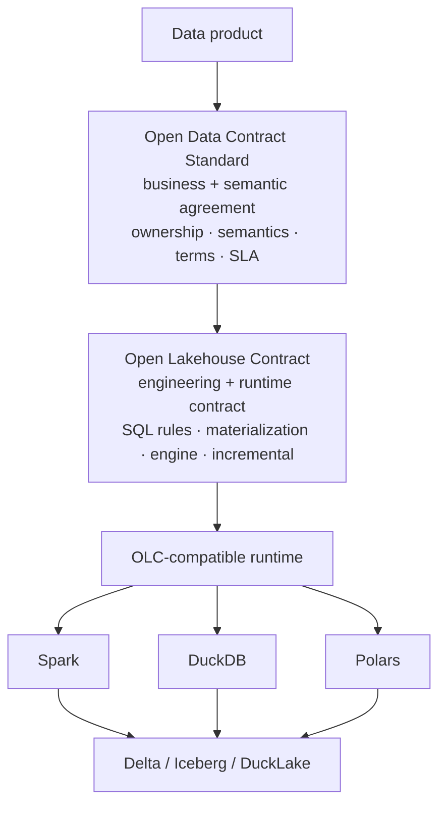
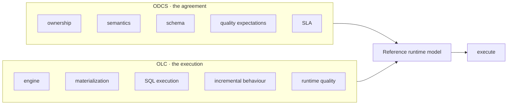

# OLC & ODCS

OLC **complements the [Open Data Contract Standard (ODCS)](https://github.com/bitol-io/open-data-contract-standard)** — it doesn't compete with it. ODCS is the excellent, widely-adopted standard for *describing* a data contract; OLC adds the *executable, lakehouse-scoped* layer that runs it. They're two points on the same axis, with a round trip between them, and the reference runtime is deliberately ODCS-interoperable so you never have to choose.

!!! tip "The short version"
    **ODCS standardises the agreement · OLC standardises the execution · the reference runtime runs both.** Use ODCS to publish and agree on a data product across teams and catalogs; use OLC to *run* it — validate, quarantine, mask, materialize. You never have to choose.

## Two layers of one data product

They're not rivals — they stack. ODCS is the *business + semantic agreement*; OLC is the *engineering + runtime* contract that carries it out:



## By concern

| Concern | ODCS | Open Lakehouse Contract |
|---|---|---|
| Data-product metadata | ✅ defines | basic |
| Schema | ✅ defines | ✅ enforces |
| Ownership / stakeholders | ✅ defines | reference / integrate |
| Business semantics | ✅ defines | reference / integrate |
| Terms / SLA | ✅ defines | ✅ **runtime enforcement** |
| Quality expectations | ✅ describes | ✅ **executable checks** |
| PII classification | ✅ classifies | ✅ **runtime masking** |
| SQL rules | some representation | **core design principle** |
| Materialization (merge / append / overwrite) | — | ✅ |
| Table format (Delta / Iceberg / DuckLake) | — | ✅ |
| Engine execution (Spark / DuckDB / Polars) | — | ✅ |
| Runtime portability | not its role | ✅ **core objective** |
| CI behaviour | validation-oriented | **contract execution** |

Read it as: **ODCS says what the data product *is and promises*; OLC says how that promise is *executed and enforced* on a lakehouse.** Where they overlap (schema, quality, SLA, PII), ODCS *declares* and OLC *enforces at runtime* — the same intent, one described, one executed.

## Round-trip interop

The reference runtime imports ODCS and can export back to it, so the two aren't a fork in the road:

```python
from lakelogic.core.models import DataContract

contract = DataContract.from_odcs("orders.odcs.yaml")   # ingest an ODCS contract
# ... run it: validate, quarantine, materialize ...
odcs = contract.to_odcs()                               # emit ODCS back out
```

There's also a CLI export (`lakelogic export-odcs`) in the reference runtime.

## Two contracts, one runtime model

The most powerful mode isn't converting one to the other — it's letting each own what it's best at, and resolving both into a single runtime model. The reference runtime validates either, and can run OLC *with* an ODCS agreement alongside:

```bash
lakelogic validate product.odcs.yaml          # validate the agreement
lakelogic validate product.olc.yaml           # validate the execution contract
lakelogic run product.olc.yaml \              # run OLC, resolving the ODCS agreement
  --data-contract product.odcs.yaml            #   (proposed)
```



The ODCS document stays the organisation's data-product *agreement*; the OLC file is the executable lakehouse *implementation*. Neither duplicates the other.

!!! note "Proposed: reference an ODCS contract from OLC"
    A future OLC version may let a contract *point at* its ODCS agreement instead of restating it, so ownership/semantics/schema live once (in ODCS) and execution lives in OLC:
    ```yaml
    version: 1.0.0
    data_contract: { standard: odcs, ref: ./customer.odcs.yaml }   # ← proposed binding
    info: { title: Customer, target_layer: gold }
    materialization: { strategy: merge, format: iceberg }
    quality:
      row_rules:
        - { name: valid_customer, sql: "customer_id IS NOT NULL" }
    ```
    This `data_contract:` binding and the `--data-contract` flag are **proposed** — not in the v1 schema yet. Today, use the [round-trip](#round-trip-interop) (`from_odcs` / `to_odcs`).

## Native vocabulary, ODCS aliases

OLC keeps its **native vocabulary lean** — the field names that map directly to executable behavior. Where ODCS uses different names for the same concept, they're accepted as **aliases** on import, so an ODCS-authored contract validates and runs without a manual rewrite. You don't have to choose one dialect at authoring time.

## When to use which

- **Publishing an agreement across teams or orgs, feeding a catalog, or getting governance sign-off?** ODCS is the lingua franca — describe it there.
- **Building the data product — enforcing quality, masking PII, materializing to a lakehouse, and wanting the contract to *be* the pipeline?** Author (or import) an OLC and run it.
- **Both?** Import ODCS → run as OLC → export ODCS. The descriptive and executable worlds stay in sync through the round trip.

!!! tip "Not either/or"
    OLC being broader than ODCS is a *scope* statement, not a value judgment. ODCS is excellent at what it targets. OLC targets the executable superset needed to actually produce and govern the dataset the contract describes.
