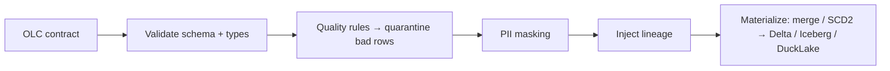

# What is OLC?

The Open Lakehouse Contract is **an executable contract for a data product**. One human-readable YAML file declares everything about a dataset — and a conforming runtime *runs* that declaration.

## Descriptive vs executable

Most data-contract specs are **descriptive**: they document a dataset's shape so humans and tools can agree on it. That's useful, but it leaves a gap — the document and the pipeline that actually produces the data are two separate artifacts, and they drift.

OLC closes the gap by being **executable**. The same file that says *"`amount` must be positive, `customer_email` is PII, materialize as a merge into Iceberg"* is the file a runtime reads to **enforce** those rules. There is no second implementation to keep in sync — the contract *is* the pipeline definition.



## The whole lakehouse surface

"Data contract" usually means *schema*. OLC deliberately covers more, because a data product is more than its columns:

| Concern | In an OLC |
|---|---|
| **Schema** | `model.fields` — names, types, required, descriptions |
| **Quality** | `quality.row_rules` (per-row SQL), `quality.dataset_rules` (uniqueness, referential) |
| **Quarantine** | Failing rows are captured *with the rule + reason*, not dropped |
| **PII / masking** | Field-level `pii: true` + `masking:` travels **with the schema** |
| **Lineage** | `lineage.enabled` — provenance columns on every row |
| **Materialization** | `strategy` (append / merge / SCD2 / overwrite) + `format` |
| **SLOs** | `service_levels` — freshness, volume, availability targets |
| **Keys** | `primary_key`, `natural_key`, surrogate-key generation |
| **Transformations** | `transformations` — declared SQL steps between source and target |

## Declarative convergence

OLC materialization is **declarative convergence**, the data-plane analogue of `terraform apply`: the contract declares the *desired* state of a table (its shape, keys, quality), and the runtime converges the *actual* table toward it.

- `strategy: append` — add new rows.
- `strategy: merge` — upsert by primary key; the table converges to "latest per key."
- `strategy: scd2` — preserve history; the table converges to a full slowly-changing dimension.
- `strategy: overwrite` — replace.

You describe the destination, not the steps. That's what makes the same contract portable across engines that each implement convergence differently under the hood.

## The invariant and the backend

The core idea in one sentence: **the contract is the invariant; the backend is swappable.**

```
          ┌─────────────────────────── OLC contract (the invariant) ──────────────────────────┐
          │ schema · quality · quarantine · PII · lineage · materialization · SLOs · keys      │
          └───────────────────────────────────────────────────────────────────────────────────┘
                    │                         │                         │
              engine: spark             engine: duckdb            engine: polars
              format: delta             format: ducklake          format: iceberg
              on: Databricks            on: MotherDuck            on: your laptop
```

Change the three lines under the fold; the contract above never moves. That's the promise the [Providers](../providers/index.md) matrix demonstrates end-to-end.
