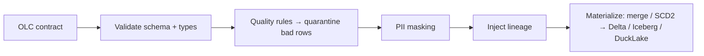
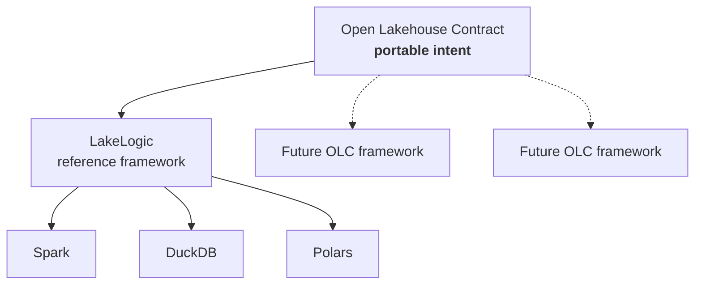

# What is OLC?

The Open Lakehouse Contract is **an executable contract for a data product**. One human-readable YAML file declares everything about a dataset — and a conforming framework *runs* that declaration.

## Descriptive vs executable

Most data-contract specs are **descriptive**: they document a dataset's shape so humans and tools can agree on it. That's useful, but it leaves a gap — the document and the pipeline that actually produces the data are two separate artifacts, and they drift.

OLC closes the gap by being **executable**. The same file that says *"`amount` must be positive, `customer_email` is PII, materialize as a merge into Iceberg"* is the file a framework reads to **enforce** those rules. There is no second implementation to keep in sync — the contract *is* the pipeline definition.



## The whole lakehouse surface

"Data contract" usually means *schema*. OLC deliberately covers more, because a data product is more than its columns:

| Concern | In an OLC |
|---|---|
| **Schema** | `model.fields` — names, types, required, descriptions |
| **Quality** | `quality.row_rules` (per-row SQL), `quality.dataset_rules` (uniqueness, referential) |
| **Quarantine** | Failing rows are captured *with the rule + reason*, not dropped |
| **PII / masking** | Field-level `pii: true` + `masking:` travels **with the schema** |
| **Lineage** | `lineage.enabled` — provenance columns on every row |
| **Materialization** | `strategy` (append / merge / SCD2 / overwrite) + `format` |
| **SLOs** | `service_levels` — freshness, volume, availability targets |
| **Keys** | `primary_key`, `natural_key`, surrogate-key generation |
| **Transformations** | `transformations` — declared SQL steps between source and target |

## Declarative convergence

OLC materialization is **declarative convergence**, the data-plane analogue of `terraform apply`: the contract declares the *desired* state of a table (its shape, keys, quality), and the framework converges the *actual* table toward it.

- `strategy: append` — add new rows.
- `strategy: merge` — upsert by primary key; the table converges to "latest per key."
- `strategy: scd2` — preserve history; the table converges to a full slowly-changing dimension.
- `strategy: overwrite` — replace.

You describe the destination, not the steps. That's what makes the same contract portable across engines that each implement convergence differently under the hood.

## The invariant and the backend

The core idea in one sentence: **the contract is the invariant; the backend is swappable.**

```
          ┌─────────────────────────── OLC contract (the invariant) ──────────────────────────┐
          │ schema · quality · quarantine · PII · lineage · materialization · SLOs · keys      │
          └───────────────────────────────────────────────────────────────────────────────────┘
                    │                         │                         │
              engine: spark             engine: duckdb            engine: polars
              format: delta             format: ducklake          format: iceberg
              on: Databricks            on: MotherDuck            on: your laptop
```

Change the three lines under the fold; the contract above never moves. That's the promise the [Providers](../providers/index.md) matrix demonstrates end-to-end.

### Engines even compose on one platform

The engine isn't locked one-per-platform — **several can share the same table.** On Databricks or Fabric, **Spark** registers a Delta table in the catalog (Unity Catalog / OneLake), and lighter engines — **Polars** or **DuckDB** — then read and update that *same* table:

```
   OLC contract ──register (Spark)──▶  Delta table  ◀──update (DuckDB / Polars)──
                        Unity Catalog / OneLake · one table, many engines
```

Heavy Spark for the big registration and compaction; DuckDB or Polars for fast, cheap incremental writes — no cluster spun up. The contract doesn't care which engine touched the table: it declares the desired shape and quality, and any conforming engine converges the table toward it.

## The contract is independent of the framework

Crucially, OLC sits *above* any particular framework. The contract is portable intent; a **conforming framework** carries it out, and that runtime is itself swappable. [LakeLogic](https://lakelogic.org) is the reference framework — but the specification does not depend on it, and a second framework in another language could implement the same contract.



Two levels of pluggability: the **framework** that interprets the contract, and the **engine + format** it targets. The contract commits to neither — that's what keeps it an open standard rather than one vendor's config file.

## Scope — and non-goals

OLC answers exactly one question:

> **What must be true about this data product and its execution?**

That question bounds the spec. Schema, quality, PII, lineage, materialization, and SLOs all answer it — they describe *the data product itself*. The discipline that keeps OLC coherent (and adoptable) is refusing to grow beyond it.

**In scope** — properties of a single data product: `model` (schema), `quality`, `pii` / masking, `lineage`, `materialization`, `service_levels`, keys, `transformations`, sources, and declared `upstream` / `downstream` edges.

**Explicit non-goals** — things that belong to *other* tools, not the contract:

| Not in the spec | Where it belongs |
|---|---|
| Orchestration / scheduling (the run DAG) | Airflow / Dagster / the mesh config — OLC declares dependencies, it doesn't schedule |
| Infrastructure provisioning | Terraform / Pulumi |
| Dashboards & BI | the consumers (captured as `downstream`, not defined here) |
| ML models / feature engineering logic | the ML platform |
| Semantic layer / metrics definitions | dbt / a metrics layer |
| Cataloguing & discovery | the catalog (ODCS is the interchange — see [OLC & ODCS](vs-odcs.md)) |
| Cost governance | FinOps tooling |

!!! tip "Why the discipline matters"
    A spec that tries to run the whole data organization becomes a spec no one can implement or agree on. OLC stays *about the data product* — one artifact a human or an agent can read and know exactly what must hold true. Everything else composes *around* it.
