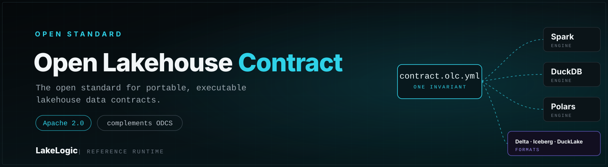

# The open standard for portable, executable lakehouse data contracts

Define a data product's sources, schema, ownership, quality rules, PII handling, lineage, service levels (SLAs and SLOs), transformations and materialisation in one portable, vendor-neutral contract.

Open Lakehouse Contract (OLC) captures that definition in a portable YAML document.

The contract holds the intent. JSON Schema validates its structure, while a conforming runtime such as [LakeLogic Core](https://github.com/LakeLogic/LakeLogic) executes the declared behaviour.

<div class="grid cards" markdown>

- :material-shield-check: **Prevent breaking changes**

    Validate contracts in CI before pipeline changes reach production.

- :material-scale-balance: **Apply governance consistently**

    Keep schema, quality, PII handling, lineage and service levels in one reviewable file.

- :material-swap-horizontal: **Keep intent portable**

    Separate the data product's intent from backend-owned engine, catalogue, storage and table-format settings.

</div>

## A minimal contract

```yaml
version: 1.0.0
info:
  title: Orders
  table_name: orders
model:
  fields:
    - name: order_id
      type: integer
      required: true
quality:
  row_rules:
    - name: positive_order_id
      sql: "order_id > 0"
```

Validate it without installing a data engine:

```bash
olc validate orders.olc.yaml
```

OLC itself does not move or transform data. A conforming runtime reads the contract and carries out the declared validation, quarantine, transformation and materialisation behaviour.

## Choose your path

<div class="grid cards" markdown>

- :material-rocket-launch: **[Get started](getting-started.md)**

    Validate and execute your first contract.

- :material-book-open-page-variant: **[Understand OLC](concepts/what-is-olc.md)**

    Learn what belongs in the standard and what belongs to a runtime.

- :material-code-json: **[Use the reference](reference/schema.md)**

    Look up every contract field and its purpose.

- :material-check-decagram: **[Review conformance](reference/conformance.md)**

    See how structural and runtime behaviour are tested.

- :material-cloud-check: **[Inspect provider evidence](providers/index.md)**

    Check what has been validated or executed on each platform.

- :material-source-branch: **[Contribute](contributing.md)**

    Propose changes, fixtures and runtime evidence.

</div>

## Current scope

OLC defines one data-product contract. It does not define infrastructure or a multi-contract mesh registry. Runtime and provider support varies, so the [conformance suite](reference/conformance.md) and [provider matrix](providers/index.md) are the source of truth for tested behaviour.

OLC v1 is under active development and is licensed under Apache 2.0.
