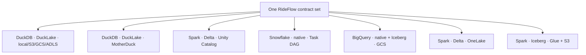

# Providers

This is the OLC equivalent of the Terraform Registry: **one canonical contract, rendered across a matrix of backends.** The RideFlow data mesh — the *same* contracts throughout — has been run on each platform below. Every provider page shows the identical contract, the framework invocation for that backend, and what it materialized.

!!! info "What's RideFlow?"
    **RideFlow** is the running example used throughout OLC: a realistic, **fictional ride-hailing company (like Uber)** — its data mesh spans **6 domains** (marketplace, payments, operations, marketing, reference, shared) across **11 source systems** (Stripe, Twilio, Zendesk, Checkr, Google Ads, HubSpot, and more), ~60 governed tables through a bronze → silver → gold medallion. It exists as one set of OLC contracts; each provider page runs *those exact contracts* on a different lakehouse. Think of it as the "hello world" that's big enough to be real — nothing here is platform-specific to any one backend.

The contract never changes between these pages. Only the `engine`, the `format`, and where the data lands do.

## The matrix

| Platform | Engine(s) | Table format | Catalog / storage |
|---|---|---|---|
| **[DuckDB / DuckLake](duckdb-ducklake.md)** | DuckDB | DuckLake | Local files, or S3 / GCS / ADLS |
| **[MotherDuck](motherduck.md)** | DuckDB | DuckLake | MotherDuck-hosted catalog |
| **[Databricks](databricks.md)** | Spark, Polars, DuckDB | Delta | Unity Catalog (managed + external ADLS) |
| **[Snowflake](snowflake.md)** | Snowflake SQL | Native tables | Snowflake database + Task DAG |
| **[BigQuery (GCP)](bigquery.md)** | BigQuery, Spark | BigQuery native, Iceberg | BigQuery datasets; Iceberg on GCS |
| **[Microsoft Fabric](fabric.md)** | Spark | Delta | OneLake (schema-enabled Lakehouse) |
| **[AWS (Glue)](aws.md)** | Spark | Iceberg | Glue Data Catalog + S3 |

!!! note "Honest by default"
    Most platforms above have been **run live** — contracts executed, real tables materialized. **Microsoft Fabric** is currently **static-validated** (contracts and deploy path validated, live run pending capacity). Each platform page states exactly what ran, and flags any parked job — no silent gaps.

## What "same contract" means here

Each provider page starts from a shared RideFlow silver contract like this:

```yaml
version: 1.0.0
info: { title: Trips, table_name: silver_rideflow_trips, target_layer: silver }
model:
  fields:
    - { name: trip_id,   type: string, required: true }
    - { name: rider_id,  type: string, required: true }
    - { name: fare_amount, type: float }
    - { name: rider_email, type: string, pii: true, masking: partial }
primary_key: [trip_id]
quality:
  row_rules:
    - { name: fare_non_negative, sql: "fare_amount >= 0" }
materialization: { strategy: merge }     # format chosen per-platform
```

The only per-platform choices are the ones a backend legitimately owns:



## Special configurations

Like Terraform's per-provider "special configuration" notes, each backend has a small number of real quirks the framework handles for you. The short version:

| Platform | Notable per-backend handling |
|---|---|
| Snowflake | UPPERCASE identifier casing + dedup ordering; `TO_VARCHAR` casts; native Project from repo root |
| BigQuery | Backtick-quoted identifiers; client location; `TEMP` needs a session; `CONCAT_WS` / `TO_DATE` rewrites |
| DuckLake | `ATTACH 'ducklake:…' (DATA_PATH …)` locally; `CREATE DATABASE … (TYPE DUCKLAKE)` on MotherDuck |
| AWS Glue | Glue Catalog-registered Iceberg; checkpoint-before-merge to avoid Catalyst plan explosion |
| Azure/Fabric | OneLake schema-enabled Lakehouse; REST/OneLake deploy via `az` token |

Each is covered on the platform's page.
