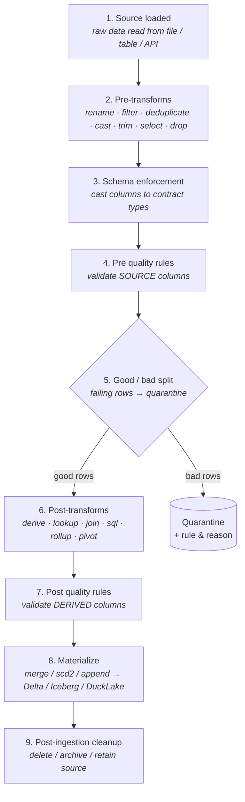

# Execution Order (pre & post)

Several parts of a contract carry a `phase: pre | post` — most visibly [transformations](transformation.md#phase-pre-or-post) and [quality rules](quality.md). "Pre" and "post" only mean something against the **run sequence**, so this page captures the whole order in one place: what runs, when, and which columns each phase can see.

## The canonical sequence

A single run executes these steps in order:



| Step | Stage | What happens |
|---|---|---|
| 1 | **Source loaded** | Raw data read from the source (file / table / API / stream). See [Ingestion](ingestion.md). |
| 2 | **Pre-transforms** | `phase: pre` transforms — shape raw input before it's checked. |
| 3 | **Schema enforcement** | Columns cast to the contract's declared types. |
| 4 | **Pre quality rules** | `phase: pre` rules validate **source** columns. |
| 5 | **Good / bad split** | Failing rows are routed to [quarantine](quality.md#quarantine) with the rule + reason; good rows continue. |
| 6 | **Post-transforms** | `phase: post` transforms — enrich validated data (joins, derived fields, rollups). |
| 7 | **Post quality rules** | `phase: post` rules validate **derived** columns. |
| 8 | **Materialize** | Converge the target table per [materialization](materialization.md). |
| 9 | **Post-ingestion cleanup** | Delete / archive / retain the consumed input — see [Lifecycle](lifecycle.md). |

## Pre vs post — the rule of thumb

The split at step 5 (good/bad) is the dividing line, and it determines what each phase can reference:

| | **Pre** | **Post** |
|---|---|---|
| Runs | Before quality checks (steps 2 & 4) | After the good/bad split (steps 6 & 7) |
| Can reference | **Source columns only** | Source **and** derived columns |
| Typical use | Clean/normalize raw input so it *passes* validation — rename, cast, trim, filter, deduplicate | Enrich validated data — derive, lookup, join, rollup, pivot, SQL |
| Operates on | The full raw dataset | Only the rows that passed validation |

!!! tip "Why the order matters"
    - **Put normalization in `pre`** so a rule like `email IS NOT NULL` checks *cleaned* values, not raw ones — otherwise you quarantine rows that a `trim`/`coalesce` would have rescued.
    - **Put enrichment in `post`** so joins/derivations run only on good rows (cheaper, and you never enrich a row that's about to be quarantined).
    - A field derived in a `post` transform can be validated by a `post` quality rule — but **not** a `pre` rule, because it doesn't exist yet at step 4.

## Declaring the phase

```yaml
transformations:
  - trim: { fields: [email], side: both }         # normalize BEFORE checks
    phase: pre
  - derive: { field: line_total, sql: "qty * price" }   # enrich AFTER the split
    phase: post

quality:
  row_rules:
    - { name: email_present, sql: "email IS NOT NULL", phase: pre }   # checks source
    - { name: total_positive, sql: "line_total > 0",   phase: post }  # checks derived
```

If you omit `phase`, each op uses its natural default (normalizing ops default to `pre`, enriching ops to `post`), but being explicit is clearer for anything order-sensitive.

## Related

- [Transformation](transformation.md) — the ops available in each phase (SQL variant + shorthand).
- [Validation & Quality](quality.md) — row/dataset rules and how the good/bad split feeds quarantine.
- [Post-Ingestion Lifecycle](lifecycle.md) — what happens to the source after step 8.
