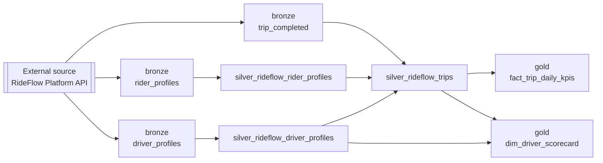

# Lineage

Lineage answers three questions, and OLC captures each at a different level:

| Level | Answers | Where it's declared |
|---|---|---|
| **1. Row provenance** | *Where did this row come from?* | `lineage:` (columns injected on every row) |
| **2. Contract graph** | *What does this data product read and who consumes it?* | `source`, `links`, `upstream`, `downstream` (in the contract) |
| **3. Pipeline DAG** | *In what order do the data products run?* | `depends_on` + `external_sources` (mesh/system config) |

Together they give end-to-end traceability — from the external system that produced a value, through every governed table, to the dashboard that reads it.

!!! abstract "Powered by"
    `LineageConfig`, `Link`, and `DownstreamConsumer` are **Pydantic** models. Row-provenance columns are injected into the output frame by the active engine (**PySpark** / **duckdb** / **polars**), so provenance is physically present in every table. The pipeline DAG (level 3) is compiled by the reference framework into an **Airflow / Dagster / Cloud Composer** schedule.

---

## 1. Row-level provenance

`lineage` (`LineageConfig`, 21 fields) controls the provenance columns stamped onto every row. `enabled: true` turns on sensible defaults; every column is individually toggleable and renameable.

```yaml
lineage:
  enabled: true
  capture_source_path: true          # which file/table the row came from
  capture_timestamp: true            # when it was ingested
  capture_run_id: true               # the run that produced it
  capture_contract_name: true
  capture_domain: true
  capture_system: true
  capture_created_at: true
  capture_created_by: true
  created_by_override: "orders-pipeline"
  preserve_upstream: [source_system, ingested_at]   # carry upstream lineage through
  upstream_prefix: "src_"
```

| Concern | Toggle | Column-name field |
|---|---|---|
| Source path | `capture_source_path` | `source_column_name` |
| Ingest timestamp | `capture_timestamp` | `timestamp_column_name` |
| Run id | `capture_run_id` | `run_id_column_name` (`run_id_source`) |
| Contract name | `capture_contract_name` | `contract_name_column_name` |
| Domain / system | `capture_domain` / `capture_system` | `domain_column_name` / `system_column_name` |
| Created at / by | `capture_created_at` / `capture_created_by` | `created_at_column_name` / `created_by_column_name` |

`preserve_upstream` carries selected lineage columns from the source **through** the transformation (optionally `upstream_prefix`-ed), so a gold row can still name the bronze file it originated from. This is what makes [masking lineage-aware](security.md#masking-is-lineage-aware) — a masking policy follows a column downstream because the provenance travels with it.

!!! note "Why provenance in the row"
    Putting provenance in the data (not an external catalog scan) means every row is *self-describing*: "where did this come from, which run, was it masked" is answerable from the data itself, on any platform, without a separate lineage service.

---

## 2. Contract-level lineage graph

A data product's contract declares its own edges — what it reads, and who reads it. This is dataset-to-dataset lineage, independent of any scheduler.

```yaml
# inputs (edges IN)
source:
  type: table
  path: "table:catalog.silver.silver_rideflow_trips"     # the primary upstream

links:                                                   # reference datasets joined in
  - { name: dim_city, table: "reference.gold_internal_dim_city", type: table, columns: [city_name, country] }

upstream: [silver_rideflow_trips, silver_rideflow_rider_profiles]   # declared upstream products

# non-contract origins (edges IN, nested) — the source→landing→bronze chain, since
# neither the source system nor the landing zone has an OLC file of its own.
upstream_sources:
  - type: landing                       # the direct producer of this contract
    name: GA4 app_events landing
    path: "{landing_root}/app_events"
    format: json
    upstream_sources:
      - type: source_system             # where the landing data came from
        name: Google Analytics 4
        system: Google LLC

# consumers (edges OUT, nested) — the table→semantic_model→report chain
downstream:
  - type: semantic_model
    name: "RideFlow Gold"
    platform: powerbi
    consumers:
      - type: report
        name: "Finance — Daily Revenue"
        platform: powerbi
        columns_used: [kpi_date, city_code, gross_revenue_amount]
        sla: "available by 07:00 UTC"
```

| Field | Model | Purpose |
|---|---|---|
| `source` | `SourceConfig` | The primary input — an edge *in*. See [Ingestion](ingestion.md). |
| `links` | `[Link]` | Reference datasets joined during transformation (`name`, `path`/`table`, `type`, `broadcast`, `columns`). See [Transformation → Joins](transformation.md#joins-lookups). |
| `upstream` | `[string]` | Declared upstream data products (names/paths) this one derives from. |
| `upstream_contracts` | `[UpstreamContractRef]` | Structured refs to upstream products that **have their own OLC contract** — carries their mesh coordinates (`contract`, `layer`, `domain`, `system`) so the chain is walked via the graph, not restated. |
| `upstream_sources` | `[UpstreamSource]` | Nested origins with **no** contract of their own — a source system, landing zone, external file/API. Captures the `source → landing → bronze` chain inline. |
| `downstream` | `[DownstreamConsumer]` | Declared consumers — dashboards, models, exports — that read this product. Nested via `consumers`. |

**Two nestable, first-class edge shapes** make impact analysis answerable from the contract
in both directions — `upstream_sources` for producers and `downstream` for consumers.

**`DownstreamConsumer`** — a consumer that reads this product; nests via `consumers`
(`table → semantic_model → report`):

| Field | Purpose |
|---|---|
| `type` **(req)** / `name` **(req)** | Kind of consumer (dashboard / model / report / export / api) and its name. |
| `platform` / `url` | Where it lives (Power BI, Tableau, a feature store…). |
| `owner` / `description` / `refresh` | Who owns it, what it's for, how often it reads. |
| `columns_used` | Exactly which columns it depends on — the impact-analysis edge. |
| `sla` | The consumer's expectation of this product. |
| `consumers` | **Nested** downstream consumers that read *through* this one (a report reading a semantic model). |

**`UpstreamSource`** — the mirror: an origin with no OLC file (source system, landing zone),
nesting via `upstream_sources` (`landing ← source_system`):

| Field | Purpose |
|---|---|
| `type` **(req)** / `name` **(req)** | Kind of origin (landing / source_system / api / file / database / stream) and its name. |
| `system` / `catalog_path` | Owning system / vendor, and its address in the source. |
| `path` / `format` | Landing path or source URI, and its format. |
| `owner` / `description` / `note` | Who owns it, what it is, free-form provenance. |
| `columns_used` | Which columns this contract draws from the origin. |
| `upstream_sources` | **Nested** origins that feed this one (the source system behind a landing zone). |

> **When to use which upstream field:** if the producer *has* an OLC contract, reference it
> with `upstream` / `upstream_contracts` and let the graph walk resolve the chain. If it
> does **not** (a raw source, a landing zone), record it inline with `upstream_sources` —
> the same reason `downstream` records BI consumers that have no contract of their own.

---

## 3. Pipeline dependencies (Airflow-style DAG)

The execution order across a whole system is a **DAG**: each contract declares which other entities it `depends_on`, and the system declares its `external_sources` (the roots — the systems outside the mesh that feed it). The reference framework turns this into an Airflow / Dagster / Cloud Composer schedule, running parents before children with maximum safe parallelism.

```yaml
# _system.yaml — the mesh orchestration layer (one level up from a single contract)
external_sources:
  - name: "RideFlow Platform API"        # a lineage root: where raw data originates
    type: api
    source_domain: "Internal Platform"
    catalog_path: "rideflow_backend_api"
    consumed_by: [rider_profiles, driver_profiles, trip_requests, trip_completed]

contracts:
  - { layer: bronze, entity: trip_completed, path: "…" }
  - layer: silver
    entity: silver_rideflow_trips
    path: "…"
    depends_on: [trip_completed, silver_rideflow_rider_profiles, silver_rideflow_driver_profiles]
  - layer: gold
    entity: gold_rideflow_fact_trip_daily_kpis
    path: "…"
    depends_on: [silver_rideflow_trips]
```

That compiles to a DAG the scheduler runs in dependency order:



| Field | Level | Purpose |
|---|---|---|
| `external_sources[]` | system | The lineage **roots** — external systems feeding the mesh. `name`, `type`, `source_domain`, `catalog_path`, `consumed_by` (which entities read it). |
| `depends_on` | contract (in `_system.yaml`) | The entities this one must run **after** — the DAG edges. FK-topological: parents before children. |

!!! note "Where the DAG lives (honest scoping)"
    `external_sources` and `depends_on` are declared in the **mesh/system config** (`_system.yaml`) — the orchestration layer *around* the per-dataset contract, not inside the OLC `DataContract` itself. The contract's own `source` / `links` / `upstream` / `downstream` express the same edges at the dataset level; the system config is what a scheduler consumes to *order the run*. Both are "lineage" — one for tracing data, one for scheduling it.

---

## The three levels together

```
external source  ─(external_sources)→  bronze  ─(depends_on / upstream)→  silver  →  gold  ─(downstream)→  dashboard
        └────────────────────── every row carries `lineage` provenance columns ──────────────────────┘
```

- **Trace a value** → row provenance (level 1).
- **Understand a product's inputs/consumers** → the contract graph (level 2).
- **Schedule the run** → the pipeline DAG (level 3).

## Related

- [Security & PII](security.md#masking-is-lineage-aware) — masking follows a column downstream via preserved provenance.
- [Service Levels (SLOs)](slo.md) — the freshness/availability/volume targets a `downstream` consumer relies on.
- [Execution Order](execution-order.md) — what runs *inside* a single contract's step in the DAG.
